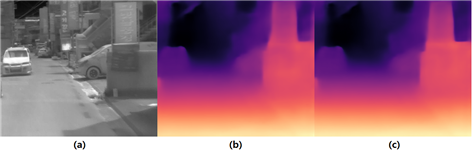

# Pseudo-Lidar

## Dataset

### KAIST TITS 2018

실험한 알고리즘은 학습 시에는 Stereo-pair images와 테스트 시에는 single image가 필요하다.
학습과 테스트는  KAIST TITS 2018 데이터 셋을 사용했다.
학습에는 3037 장,테스트에는 1784 장이 포함되어있다. 

## Dataloader
Dataloader는 폴더의 다음 구조를 가정합니다 ("data_dir" 에는 Kaist_data이 들어가야한다.)
왼쪽 영상의 경우 LEFT 폴더 속에있고 , 오른쪽 영상의 경우 RIGTH에 있으니 찾기 쉬울 것이다. <b>그리고 데이터를 불러오기 위한 txt 파일은 Kaist에서 제공되는 것이 아니니 ```cp``` 나 ```mv```를 이용해 txt를 옳겨줘야한다.</b>

예 ) 데이터 폴더 구조 (이 예에서는 "Kaist_data" 디렉토리 경로를 'data_dir' 로 전달해야 한다 ) :
```
data
├── Kaist_data
│   ├── training
│   │   ├── Campus
│   │   │   ├─ DEPTH
│   │   │   │   ├── DEPTH_000000000.mat
│   │   │   │   └── ...
│   │   │   ├─ LEFT
│   │   │   │   ├── LEFT_000000000.jpg
│   │   │   │   └── ...
│   │   │   ├─ RIGTH
│   │   │   │   ├── RIGHT_000000000.jpg
│   │   │   │   └── ...
│   │   │   ├─ THERMAL
│   │   │   │   ├── THERMAL_000000000.jpg
│   │   │   │   └── ...
│   │   ├── Urban
│   │   │   ├── DEPTH
│   │   │   │   ├── DEPTH_000000000.mat
│   │   │   │   └── ...
│   │   │   └── ...
│   │   └── ...
│   ├── testing
│   │   ├── Campus
│   │   │   ├─ DEPTH
│   │   │   └── ...
│   │   └── ...
│   ├── txt
│   │   ├── train.txt
│   │   ├── test.txt
│   │   ├── test_depth.txt
│   └── ...
├── models
├── output

```

## train
- 학습하기 위한 간단한 실행 명령어는 start2train.sh 에 있으며, 데이터 경로를 맞춰주고 start2train.sh을 실행 시켜주면 학습이 될 것이다.
   - 이 경우 Self-Guided loss를 사용한다.  
```
bash start2train.sh
```


## test
테스트 argument는 학습과 동일하며 테스트 하기 위한 실행 명령어는 eval.sh 에 있으니 그것을 실행 시키면 된다.

```
bash eval.sh
```

### Requirements
This code was tested with PyTorch 0.4.1, CUDA 9.1 and Ubuntu 16.04. Other required modules:

```
torchvision
numpy
matplotlib
```


## 정량적 평가

- 추정된 깊이 정보의 성능 평가를 위해 성능평가지표(evaluation metric)로 RMSE(Root Mean Squre Error)와 RMLSE((Root Mean Squre Logarithmic Error)를 사용 하였음

- 기존 단일 영상 깊이 추정 방법론들은 깊이 추정 모델로 한정된 수용 영역(receptive field)를 가지는 CNN을 활용하고 있어 넒은 영역에 대한 깊이 추정에 대한 성능이 떨어지고 있음.  
- 이 문제를 해결하기 위해서, 본 연구진은 광범위한 상관관계를 계산하여 다양한 컴퓨터비전 분야에서 매우 뛰어난 성능을 보여주고 있는 비전 트랜스포머를 적용하여 넒은 영역에 대한 성능을 향상시킴. 
- 하지만, 트랜스포머는 넒은 영역에 대해 성능향상을 보여주는 장점이 있지만 지역 정보에서의 성능이 안 좋다는 단점이 존재 있으며, 이러한 문제를 극복하기 위해 전역적인 문맥 정보를 잘 살리면서 동시에 세부적인 영역의 표현력을 향상시킬 수 있는 새로운 디코더 모듈 Pixel-Wise Skip Attention(PWSA)를 제안함. 


- 본 연구진은 열화상 영상으로부터 예측되는 깊이 맵의 전역 정보를 향상시키기 위해서 Transformer Ren 를 적용함 
- Transformer를 적용한 결과를 살펴보면, 적용한 결과 정량적이 지표 전부(RMSE, RMLSE) 높은 성능 향상 했음

| model |  입력영상| RMSE <50m | RMLSE<50m | 
|:-----: | :-----:|:-----: |:-----: |
| ResNet |   열화상  |  3.082 |  0.1596  | 
| Transformer |   열화상 |  2.791 |  0.1150 |r

- 본 연구진은 지역정보의 성능이 하락된다는 단점을 가지고 있는 Transformer의 단점을 해결하고자 모든 픽셀별로 어텐션을 따로 줘서 지역정보를 향상시키는 ㉠(Pixel Wise Skip Attention)을 설계함 
- 아래의 실험 결과를 통해 본 연구진이 설계한 ㉠(Pixel Wise Skip Attention)가 열화상 영상을 이용한 깊이 추정 성능을 향상시킨 것을 증명함 
- 또한 기존 CNN 기반에서 가장 좋은 성능을 보이고 있는 DIFFNet 과 비교 했을 때 제안하는 방법론이 월등히 성능이 좋은 것을 볼 수 있음

| model |  입력영상| RMSE <50m | RMLSE<50m | 
|:-----: | :-----:|:-----: |:-----: |
| ResNet |   열화상  |  3.363 |  0.1373  | 
| Transformer |   열화상 |  2.791 |  0.1150 |
| Transformer+㉠ |  열화상 |  *2.785* |  *0.1137* | 

## 정성적 평가
- 아래 그림의 정성적 결과인 (b,c) 와(d)를 비교해 보면, 본 연구진이 제안한 Transformer와 어텐션 방식을 활용한 연구인 (d)가 물제의 전역적인 정보와 지역적인 정보를 모두 잘 살린 결과를 확인할 수 있음

 (a) 열화상영상, (b) ResNet 결과, (c) DIFFNet 결과 (d) 제안하는 방법론(Transformer+㉠) 결과


